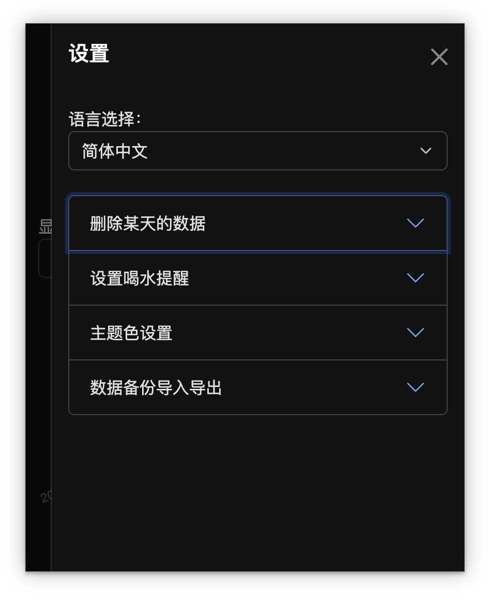

# Water Tracker Chrome 扩展插件

这是一个 Chrome 扩展插件，用于帮助您记录每日喝水次数。它会记录您每天喝水的次数，并以图表的形式展示这些数据。您可以查看过去几天的喝水情况、删除某一天的数据，并设置喝水提醒功能。



## 功能

- **记录喝水次数**：点击“记录喝水”按钮来记录每天的喝水次数。
- **数据可视化**：查看最近 7 天或 30 天的喝水次数，或查看所有数据。
- **删除数据**：可以删除指定日期的喝水记录。
- **灵活的时间范围选择**：可以选择查看最近 7 天、30 天，或所有历史数据。
- **喝水提醒**：可以设置定时提醒，提醒您按时喝水，帮助养成健康的喝水习惯。

## 如何使用

1. 安装该扩展插件到 Chrome 浏览器。
2. 点击浏览器工具栏上的扩展图标，打开弹出窗口。
3. 点击“记录喝水”按钮，记录当天的喝水次数。
4. 从下拉菜单中选择时间范围，查看最近 7 天、30 天，或所有数据的图表。
5. 如果需要删除数据，输入日期并点击“删除”按钮。
6. 在设置页面中，您可以设置喝水提醒时间间隔（例如每隔 60 分钟提醒一次），并开启或关闭提醒功能。

## 喝水提醒功能

- **设置提醒时间间隔**：在设置界面，您可以输入提醒时间（单位：分钟），例如设置为 60，表示每 60 分钟提醒一次。
- **开启提醒功能**：勾选“开启提醒”选项，系统将按照您设定的时间间隔提醒您喝水。
- **提醒方式**：插件会在设定时间间隔到达时，通过弹出通知提醒您喝水。

## 数据格式

该扩展插件使用以下格式将数据保存在 Chrome 的 `localStorage` 中：

```json
{
  "waterData": {
    "username": "Admin",
    "records": [
      {
        "date": "YYYY-MM-DD",
        "count": 5
      },
      {
        "date": "YYYY-MM-DD",
        "count": 3
      }
    ],
    "reminder": {
      "enabled": true,
      "interval": 60
    }
  }
}
```

"reminder"：保存提醒设置，其中：
"enabled"：布尔值，表示是否启用提醒功能。
"interval"：提醒时间间隔，单位为分钟。

## 文件结构

```
├── background.js   # 后台脚本，用于扩展的生命周期管理
├── content.js      # 页面内容脚本，用于与页面交互
├── popup.html      # 弹出窗口的 HTML 文件
├── popup.css       # 弹出窗口的样式文件
├── popup.js        # 弹出窗口的 JavaScript 脚本
├── reminder.js     # 喝水提醒功能脚本
├── manifest.json   # 扩展插件的配置文件
```

### 如何部署

在 Chrome 浏览器中，访问 chrome://extensions/ 页面。
开启“开发者模式”。
点击“加载已解压的扩展程序”，选择此项目的目录进行加载。
安装完成后，点击工具栏上的扩展图标，开始使用插件。
